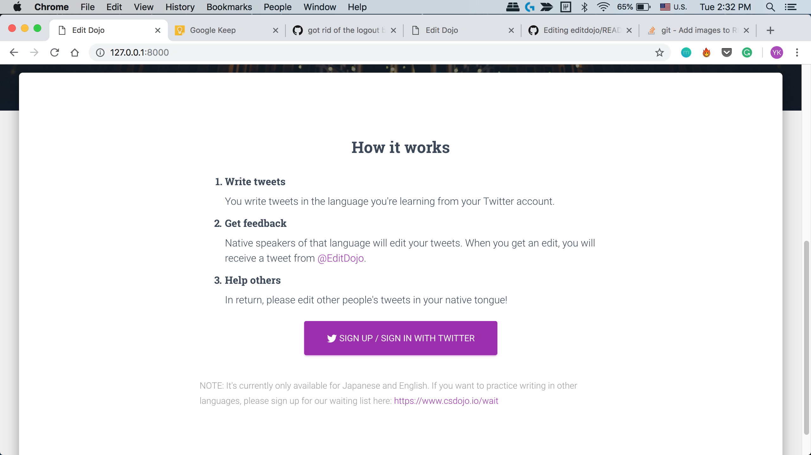

# Edit Dojo
A web app to improve writing skills in any language.

## Screenshots



## Inspiration
The inspiration for this came from the lack of these kind of resources. You can find a ton of resources to master reading, listening or speaking a language. But when it comes to writing, there simply aren't much. 

## How it works
The app will function in these steps:
1. A user A will sign up with 2 languages, one in which they are proficient(say, English) and the other which they want to learn(say, Japanese).
2. Then they will write anything they need in, say, Japanese.
3. A user B, who is proficient in Japanese, will then verify and propose corrections.
4. Similarly if someone wants to learn English, user A can verify their messages.
5. Everyone is happy.

Initially the app will be based on twitter, that is, users will be editing tweets. Eventually, you will able to use this app without using Twitter at all!

## Waiting list
If you'd like to get an email when this website/app is ready, please sign up to our waitlist here: https://www.csdojo.io/wait

## Pre-requisites
We would need following installed in our system before we start with setting up the project in local machine.
1. Git - This is needed as a version control system. If you don't have this preinstalled in local machine, visit https://git-scm.com/downloads and setup git on local.
2. Python 3 - We are using Python as a programming language in this project. Mac and Ubuntu have it pre-installed. NOTE: you might have Python 2 on your Mac or Ubuntu. If so, make sure to download Python 3.

## Local Setup
1. Clone this repository into local system and change the directory.
   
```sh
git clone https://github.com/ykdojo/editdojoprivate.git
cd editdojoprivate/
```
2. Install pip3 and pipenv.

```sh
pip3 install pipenv
```
3. Go into the virtual environment: 
   
```sh
pipenv install
pipenv shell
```
3. Apply migrations
   
```sh
python manage.py makemigrations
python manage.py migrate
python manage.py loaddata languages.yaml
# NOTE: you can produce the same data in languages.yaml with
# python manage.py dumpdata users.Language --format=yaml > languages.yaml
```
5. Go to Users/keys_format.py
- Copy this file to a new file called keys.py.
- Add your Twitter API credentials in keys.py.

6. Run the server:

```sh
python manage.py runserver <PORT>
OR
python manage.py runserver
```

7. Start the application opening the link shown in your terminal on a browser.

8. Set up django-allauth.
- First, register for a Twitter developer account.
- Then, run ``python manage.py createsuperuser`` to create an admin account.
- Go to http://127.0.0.1:8000/admin, and change the default site to from example.com to 127.0.0.1. Then, register your Twitter app's info there.
- Also, make sure to set up keys.py (as explained above).
- More about this process [here](https://wsvincent.com/django-allauth-tutorial/) and [here](https://django-allauth.readthedocs.io/en/latest/providers.html).

## Resources
This is a part of the series of YouTube videos demonstrating how to build a real startup using Python and Javascript.
Useful resources for this project:
- YouTube video link: https://www.youtube.com/watch?v=UyQn0BhVqNU
- Slack group and more info: https://www.csdojo.io/edit
- Waiting list for this app: https://www.csdojo.io/wait
- Recommended Django book for beginners: http://csdojo.io/dj (It's a referral link. When you buy a copy from this link, YK gets paid a little bit - which will help him continue working on this project full-time.)
- Sample chapters of this book: https://djangoforbeginners.com/

### Created by
The project was started by: YK Sugi. He's the guy who's running CS Dojo, a programming education YouTube channel.

If you have any questions related to this project, please contact him on our Slack group.

### Contributors
See: [CONTRIBUTORS](https://github.com/ykdojo/editdojo/graphs/contributors)
